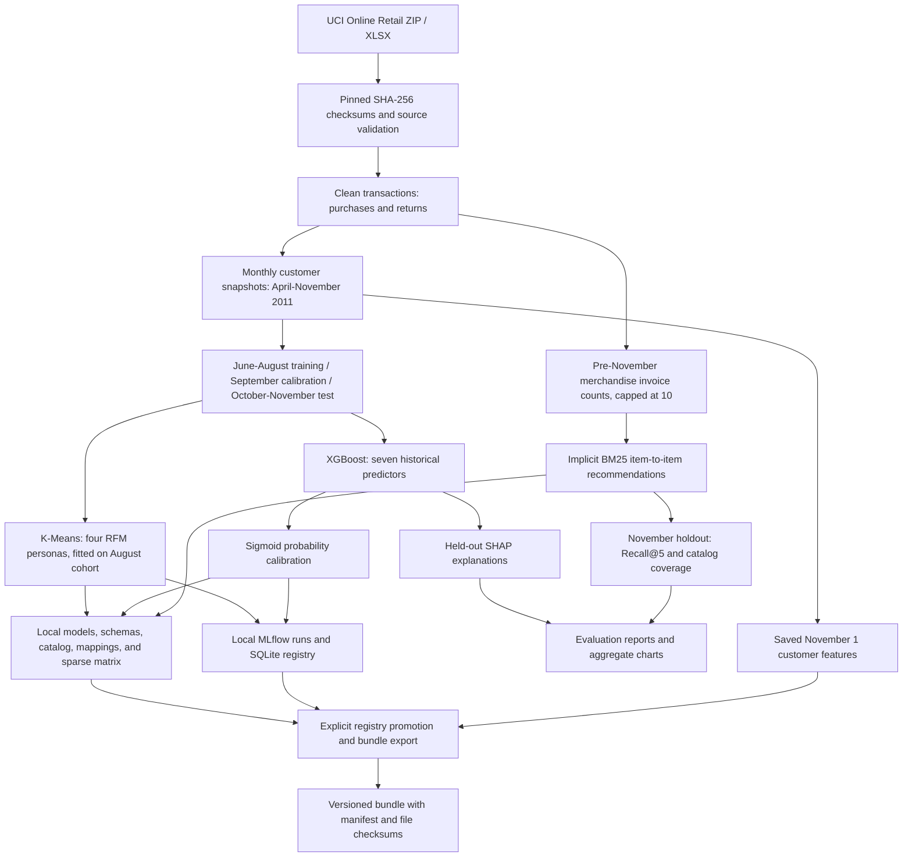
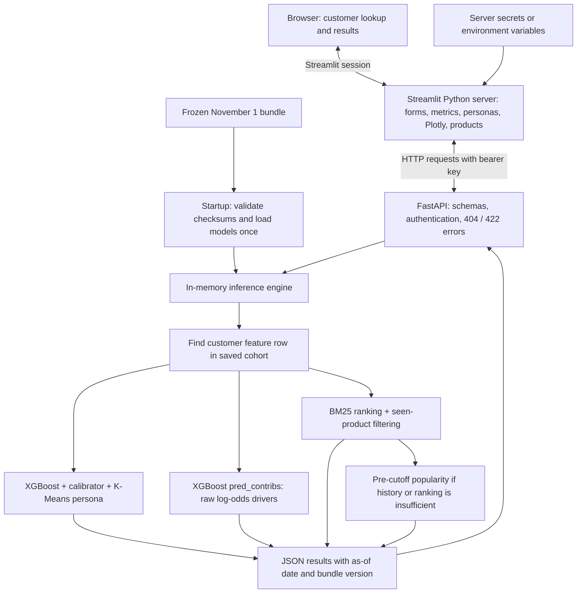

# E-Commerce Intelligence Engine

A local customer analytics application built with FastAPI and Streamlit. It uses historical retail transactions to show customer personas, a 30-day inactivity probability, model contributions, and product recommendations.

## Features

- Four customer personas based on recency, frequency, and monetary value.
- Calibrated XGBoost predictions with SHAP contributions.
- BM25 recommendations that exclude previously purchased products.
- Bearer-key authentication and a responsive dashboard.
- Local MLflow tracking, a SQLite model registry, and versioned inference bundles.

The application uses the [UCI Online Retail dataset](https://archive.ics.uci.edu/dataset/352/online+retail), provided by Daqing Chen under CC BY 4.0. It serves a fixed historical snapshot dated **November 1, 2011**. No cloud service is deployed.

## Run on your PC

These instructions use **Windows PowerShell** on a 64-bit Windows PC. Docker is not required. Run commands one step at a time and stop if any step reports an error.

**Already set up this exact folder?** If `.venv\Scripts\python.exe` and a generated bundle in `artifacts\bundles\` already exist, skip to **Start the API**. A new ZIP download or clone is a separate copy and needs its own environment and generated models.

### 1. Install and verify Python 3.12

Install **64-bit Python 3.12**, not Python 3.14. The project declares Python `>=3.11,<3.14`; these instructions are verified with Python 3.12. Having only Python 3.14 installed does not satisfy the prerequisite.

For a conventional Windows installer, open the [official Python 3.12.10 release page](https://www.python.org/downloads/release/python-31210/), scroll to **Files**, and download **Windows installer (64-bit)**. Run the installer with the Python launcher enabled. You can keep another Python version installed alongside it.

Close and reopen PowerShell after installation, then run:

```powershell
py -3.12 --version
```

**Expected:** `Python 3.12.x`. If you see **No suitable Python runtime found**, install Python 3.12 before continuing. The `python` command may still select a different installed version; use `py -3.12` to create this environment.

### 2. Download the project: choose ZIP or Git

The repository is public; no GitHub account or sign-in is needed. Internet access is required for the first setup.

**Option A - ZIP download (Git is not needed)**

1. Open the [repository](https://github.com/mehulp007/ecommerce-intelligence-engine) and select **Code > Download ZIP**.
2. Extract the ZIP completely. Open the extracted project folder, usually named `ecommerce-intelligence-engine-main`.
3. Open PowerShell in the folder that contains `pyproject.toml`, `README.md`, `api`, and `ui`. In File Explorer, open that folder, type `powershell` in its address bar, and press Enter.
4. Continue to step 3. **Do not run `git clone` inside the extracted ZIP folder.**

**Option B - Git clone**

Install Git for Windows, open PowerShell in the parent folder where you want to save the project, and run:

```powershell
git clone https://github.com/mehulp007/ecommerce-intelligence-engine.git
cd ecommerce-intelligence-engine
```

Both options should leave PowerShell in the project root. Check it:

```powershell
Get-Location
Test-Path .\pyproject.toml
```

The second command must return **True**. If it returns False, open the correct extracted or cloned folder before proceeding.

### 3. Create the environment and install dependencies

Run from the project root:

```powershell
py -3.12 -m venv .venv
if ($LASTEXITCODE -ne 0) { throw "Python 3.12 environment creation failed. Stop here." }
.\.venv\Scripts\python.exe --version
```

Verify that the final command prints **Python 3.12.x**, then install the dependencies:

```powershell
.\.venv\Scripts\python.exe -m pip install --upgrade pip setuptools wheel
if ($LASTEXITCODE -ne 0) { throw "Build-tool installation failed. Stop here." }
.\.venv\Scripts\python.exe -m pip install -r requirements-dev.txt -r requirements-train.txt -r requirements-recommend.txt -r requirements-api.txt -r requirements-ui.txt
if ($LASTEXITCODE -ne 0) { throw "Dependency installation failed. Stop here." }
.\.venv\Scripts\python.exe -m pip check
```

The final check should report **No broken requirements found**. First-time dependency installation can take several minutes; wait for PowerShell to return to its prompt before running the next command. The commands use the environment's Python directly, so no activation or PowerShell execution-policy change is needed. Do not proceed if `.venv\Scripts\python.exe` is missing or installation failed.

### 4. Download the data, train the models, and create a bundle

A fresh checkout does **not** contain raw data, trained models, customer records, or serving bundles. Run these commands in order, waiting for each one to finish:

```powershell
.\.venv\Scripts\python.exe -m ecommerce_intelligence.data.pipeline
if ($LASTEXITCODE -ne 0) { throw "Data preparation failed. Stop here." }
.\.venv\Scripts\python.exe -m ecommerce_intelligence.models.train
if ($LASTEXITCODE -ne 0) { throw "Model training failed. Stop here." }
.\.venv\Scripts\python.exe -m ecommerce_intelligence.recommendations.train
if ($LASTEXITCODE -ne 0) { throw "Recommender training failed. Stop here." }
.\.venv\Scripts\python.exe -m ecommerce_intelligence.serving.promote
if ($LASTEXITCODE -ne 0) { throw "Bundle promotion failed. Stop here." }
```

The data pipeline downloads the approximately 24 MB UCI workbook automatically. Training time depends on your PC. Promotion prints the generated bundle version. Keep the generated files on your PC; the API needs them to run. Repeat this step only when rebuilding the data or models.

Check each stage before moving on:

| Stage | Successful completion |
|---|---|
| Data preparation | Prints validated rows, purchase lines, and customer snapshots; creates `data/processed/customer_snapshots.parquet`. |
| Model training | Prints held-out ROC AUC, average precision, and Brier score; creates the persona model, XGBoost model, and calibrator. |
| Recommender training | Prints BM25 Recall@5 and coverage; creates the recommender, mappings, catalog, and interaction matrix. |
| Promotion | Prints `Promoted serving bundle: uci-2011-11-01-...`; creates a bundle folder containing `manifest.json`. |

### 5. Start the API - PowerShell window 1

Open PowerShell in the project root. Keep this window running after starting the API:

```powershell
if (-not (Test-Path .\.venv\Scripts\python.exe)) { throw "No environment found. Complete step 3 in this folder." }
$bundle = Get-ChildItem .\artifacts\bundles -Directory -ErrorAction SilentlyContinue | Where-Object { Test-Path (Join-Path $_.FullName 'manifest.json') } | Sort-Object LastWriteTime -Descending | Select-Object -First 1
if (-not $bundle) { throw "No serving bundle found. Complete step 4 first." }
$env:EIE_BUNDLE_DIR = $bundle.FullName
$env:EIE_API_KEY = Read-Host "Choose a local API key"
.\.venv\Scripts\python.exe -m uvicorn api.main:app --host 127.0.0.1 --port 8000
```

Enter a nonempty key of your choice and remember it for the dashboard. Wait for **Application startup complete**. Keep this window running.

### 6. Start the dashboard - PowerShell window 2

Open a **second PowerShell window in the same project root** using File Explorer as in step 2. Run:

```powershell
if (-not (Test-Path .\ui\app.py)) { throw "Open PowerShell in the project root first." }
Invoke-RestMethod http://127.0.0.1:8000/health
$env:EIE_API_URL = "http://127.0.0.1:8000"
$env:EIE_API_KEY = Read-Host "Enter the same API key"
.\.venv\Scripts\python.exe -m streamlit run ui/app.py --server.address 127.0.0.1 --server.port 8501
```

The health check must return `status: ready` and a bundle version. If it cannot connect, start the API in window 1 and wait for startup to complete before starting the dashboard. Enter exactly the same key as in the API window. The first browser visit initializes the Streamlit application.

Open **http://127.0.0.1:8501/** in your browser. Choose a verified sample ID and click **View customer intelligence**. To use a typed ID, leave the sample selector on **Choose a sample**.

Keep both PowerShell windows running while using the application. Press **Ctrl+C** in each window to stop it. On later visits, repeat steps **5 and 6** only; you do not need to recreate the environment or retrain.

### Troubleshooting

| Problem | What to do |
|---|---|
| `py` is not recognized | Install Python 3.12 with its Windows launcher, then reopen PowerShell. |
| `No suitable Python runtime found` | Only another Python version is installed or registered. Install 64-bit Python 3.12, reopen PowerShell, and verify `py -3.12 --version`. |
| `.venv\Scripts\python.exe` is not recognized | Environment creation failed, or PowerShell is in the wrong folder. Verify `Test-Path .\pyproject.toml`, then complete step 3. |
| No bundle found | Complete step 4 in this specific project folder before starting the API. |
| API unavailable | Start the API, wait for startup to complete, and check that both windows use port 8000. |
| API key rejected | Restart both services with matching keys. If using `.streamlit/secrets.toml`, its settings take precedence over dashboard environment variables. |
| Customer not found | Choose a verified sample ID. The API accepts only the saved November 2011 cohort. |
| Port already in use | Stop the previous server with Ctrl+C before starting another instance. |
| `/` on port 8000 shows `Not Found` | This is expected: use port 8501 for the dashboard, `/health` for readiness, or `/docs` for API documentation. |

## API routes

| Method | Route | Authentication | Purpose |
|---|---|---|---|
| GET | `/health` | None | Readiness and bundle version |
| GET | `/demo/customers` | Bearer key | Verified sample customer IDs |
| POST | `/predict/churn` | Bearer key | Inactivity probability, persona, and contributions |
| POST | `/recommend` | Bearer key | Up to five product recommendations |

Prediction requests use `{"customer_id":"12347"}`. Recommendation requests use `{"customer_id":"12347","limit":5}`. Unknown IDs return 404; malformed inputs return 422. Swagger documentation is available at **http://127.0.0.1:8000/docs** when the API is running.

Keys are read from environment variables. The dashboard also supports `API_URL` and `API_KEY` in an untracked `.streamlit/secrets.toml` file; see `.streamlit/secrets.toml.example`. API requests are made by the Streamlit Python server, so the bearer key is not placed in browser code or URLs.

## Architecture

### Offline preparation and training



Features use transactions strictly before each snapshot. Labels measure whether a qualifying purchase occurs in the following 30 days. Customer IDs, snapshot dates, and targets are never XGBoost predictors. Training and promotion run locally and are separate from serving requests.

### Runtime request flow



The browser communicates with Streamlit; the Streamlit server calls FastAPI and holds the API key. FastAPI accepts IDs in the saved cohort, retrieves historical features, and returns predictions and product suggestions. IDs outside that cohort return 404. Cohort members without merchandise interactions receive the popularity fallback. The API does not download data, train models, or write new registry versions during requests.

### Components and storage

| Component | Main modules | Responsibility |
|---|---|---|
| Ingestion | `data/source.py`, `data/cleaning.py`, `data/pipeline.py` | Download, checksum validation, transaction cleaning, and Parquet output |
| Features | `features/snapshots.py` | Monthly RFM/history features and forward 30-day labels |
| Modeling | `models/temporal.py`, `personas.py`, `churn.py`, `explain.py`, `train.py` | Locked time split, segmentation, calibrated inactivity model, SHAP, and evaluation |
| Recommendations | `recommendations/interactions.py`, `recommender.py`, `evaluation.py`, `train.py` | Sparse interactions, BM25 fitting, seen-product exclusion, fallback, and holdout metrics |
| Serving | `serving/promote.py`, `bundle.py`, `engine.py` | Register selected versions, export/check bundles, and perform inference |
| HTTP API | `api/main.py` | Request/response schemas, bearer authentication, routes, and startup loading |
| Dashboard | `ui/app.py`, `client.py`, `styles.css` | Server-side requests, customer forms, charts, cards, and responsive styling |

The data, feature, model, recommendation, and serving modules above live under `src/ecommerce_intelligence/`.

| Folder | Contents |
|---|---|
| `src/ecommerce_intelligence/` | Data, features, models, evaluation, recommendations, and serving |
| `api/` | FastAPI routes and request/response schemas |
| `ui/` | Streamlit application, API client, and CSS |
| `tests/` | Data, temporal leakage, model, API, and client checks |
| `reports/` | Aggregate evaluation results and charts |
| `data/` | Generated local transactions, snapshots, and predictions |
| `artifacts/` | Generated local models and inference bundles |
| `docker/` | API Dockerfile; optional Compose configuration is at the project root |

The bundle includes XGBoost JSON, the probability calibrator, the RFM pipeline and persona names, feature/recommender schemas, the product catalog, customer-product mappings, sparse interactions, saved customer features, and a checksum manifest. MLflow's `mlflow.db` and `mlruns/` stay local; serving uses the exported bundle without requiring a running MLflow server. Docker/Compose packages the API only; Streamlit runs as a separate process.

## Measured results

The inactivity model trains on June-August 2011, calibrates on September, and evaluates on October-November. April and May are excluded from supervised training because their 180-day histories are incomplete. The recommender trains on purchases before November 1 and evaluates on November purchases.

| Metric | Result |
|---|---|
| Held-out inactivity ROC AUC | 0.710 |
| Held-out average precision | 0.795 |
| Held-out Brier score | 0.194 |
| Persona silhouette score | 0.366 |
| BM25 Recall@5 | 3.12% |
| Popularity baseline Recall@5 | 1.14% |
| BM25 catalog coverage@5 | 19.46% |

These are recorded local training results, not guarantees for other data. Detailed metrics are in `reports/milestone2_metrics.json` and `reports/recommender_metrics.json`.

## Checks

```powershell
.\.venv\Scripts\python.exe -m pytest -q
.\.venv\Scripts\python.exe -m ruff check src tests api ui
.\.venv\Scripts\python.exe -m black --check src tests api ui
```

Checks that need locally generated models or predictions are skipped until training and promotion are complete.

## Limitations

- The target is a **30-day inactivity proxy**, not confirmed account cancellation.
- SHAP contributions explain raw XGBoost log-odds, not additive calibrated probabilities or causal effects.
- Product prices are historical medians, not live prices or inventory.
- Recommendations exclude products already bought before the cutoff. Cohort members without merchandise history receive a popularity fallback.
- Raw data, customer-level outputs, MLflow files, trained models, bundles, and real secrets stay outside Git.
- Docker/Compose configuration is included, but its image has not been built or tested on this PC. It requires a generated local bundle.
